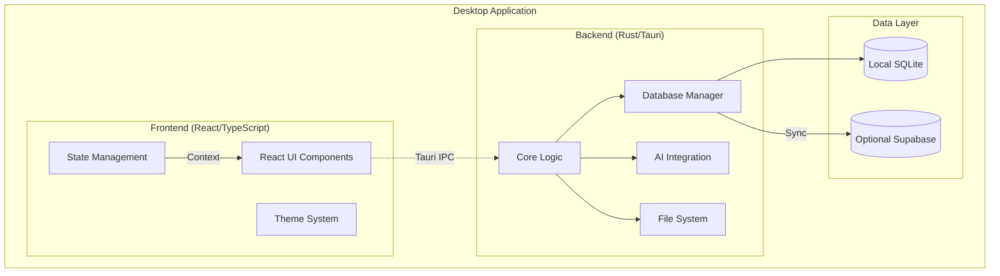
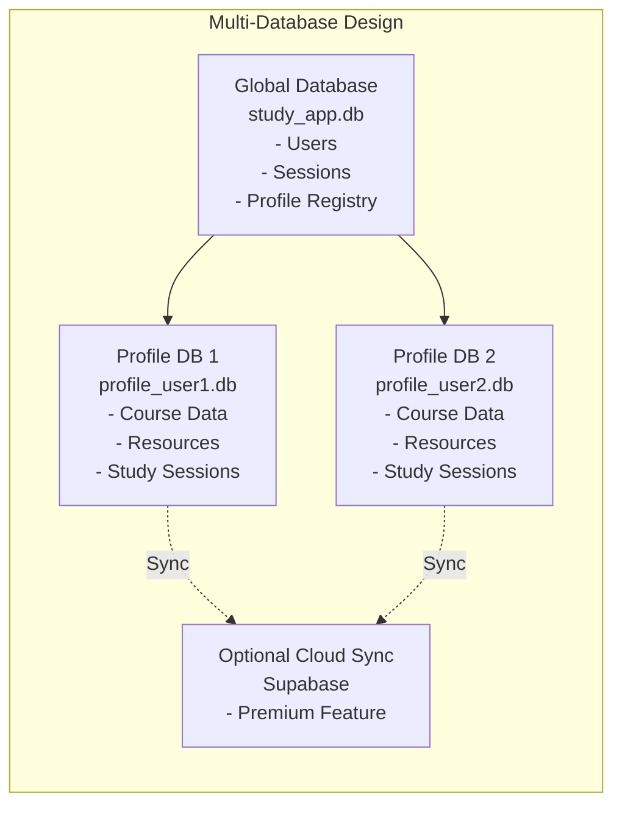
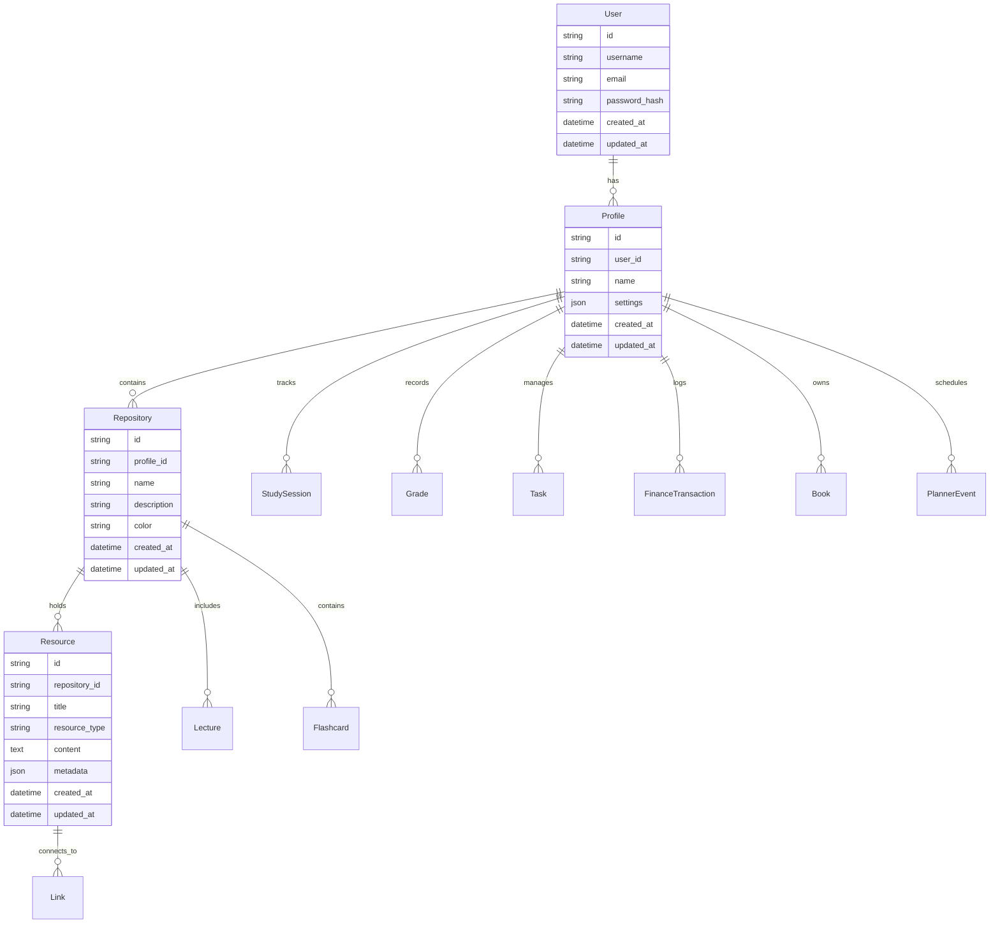
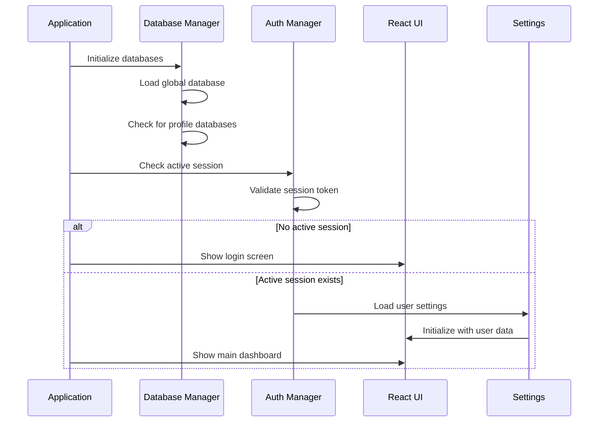
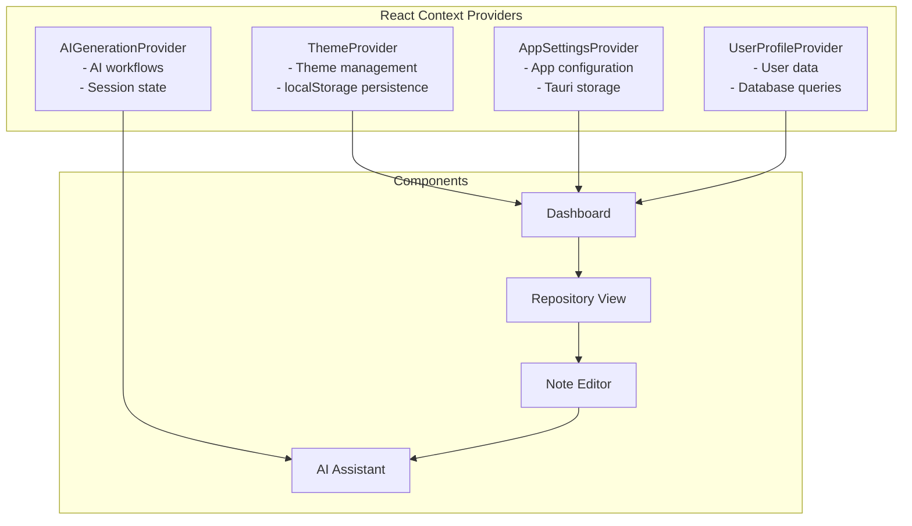

# Uni Study App - Architecture Documentation

## Overview

The Uni Study App is a **hybrid desktop application** built with the Tauri framework, combining a modern React frontend with a high-performance Rust backend. It follows a **local-first architecture** with optional cloud synchronization, designed as a comprehensive academic productivity platform for students.

## High-Level Architecture

### ASCII Architecture Diagram

```
╔══════════════════════════════════════════════════════════════════════════════╗
║                        UNI STUDY APP ARCHITECTURE                            ║
╠══════════════════════════════════════════════════════════════════════════════╣
║                                                                              ║
║  ┌─────────────────────────────────────────────────────────────────────┐     ║
║  │                    DESKTOP APPLICATION                              │     ║
║  │                                                                     │     ║
║  │  ┌─────────────────────┐    ┌─────────────────────┐                 │     ║
║  │  │   FRONTEND (REACT)  │    │   BACKEND (RUST)    │                 │     ║
║  │  │                     │    │                     │                │      ║
║  │  │  ┌───────────────┐  │    │  ┌───────────────┐  │                │      ║
║  │  │  │   React UI    │  │◄──►│  │ Core Logic    │  │                │      ║
║  │  │  │   Components  │  │    │  │ & Commands    │  │                │      ║
║  │  │  └───────────────┘  │    │  └───────────────┘  │                │      ║
║  │  │                     │    │                     │    ┌─────────┐  │     ║
║  │  │  ┌───────────────┐  │    │  ┌───────────────┐  │    │   AI    │  │     ║
║  │  │  │ State Mgmt    │  │    │  │ Database Mgr   │◄───┤ Models  │  │       ║
║  │  │  │ (Contexts)    │  │    │  │               │  │    │ (Local) │  │     ║
║  │  │  └───────────────┘  │    │  └───────────────┘  │    └─────────┘  │     ║
║  │  │                     │    │                     │                │      ║
║  │  │  ┌───────────────┐  │    │  ┌───────────────┐  │    ┌─────────┐  │     ║
║  │  │  │ Theme System  │  │    │  │ File System   │  │    │ Cloud   │  │     ║
║  │  │  └───────────────┘  │    │  │ & PDF Tools   │  │    │ Sync    │  │     ║
║  │  └─────────────────────┘    │  └───────────────┘  │    │(Optional)│  │    ║
║  │                               └─────────────────────┘    └─────────┘  │   ║
║  │                                     │                               │     ║
║  │           ┌─────────────────────────┼─────────────────────────┐     │     ║
║  │           ▼                         ▼                         ▼     │     ║
║  │  ┌─────────────────┐    ┌─────────────────┐    ┌─────────────────┐ │      ║
║  │  │ Local SQLite   │    │ Supabase Cloud  │    │ User File System│ │       ║
║  │  │ (Primary)      │    │ (Premium Sync)  │    │ (Documents, etc)│ │       ║
║  │  └─────────────────┘    └─────────────────┘    └─────────────────┘ │      ║
║  └─────────────────────────────────────────────────────────────────────┘     ║
║                                                                              ║
╚══════════════════════════════════════════════════════════════════════════════╝

    Tauri IPC Bridge (Secure, Type-safe)
```

### Mermaid Architecture Diagram



## Technology Stack

### Frontend
- **Framework**: React 19.1.0 + TypeScript
- **Build System**: Vite 7.0.4
- **Styling**: Tailwind CSS 3.4.18
- **Animations**: Framer Motion 12.23.26
- **3D/Graphics**: React Three Fiber, Three.js
- **Data Visualization**: React Force Graph 2D, Recharts, Mermaid
- **Desktop Integration**: Tauri APIs

### Backend
- **Framework**: Tauri 2.x
- **Language**: Rust
- **Database**: SQLite (rusqlite)
- **AI/ML**: Llama.cpp bindings, Ollama client
- **Authentication**: Argon2
- **File Processing**: lopdf, image crate
- **Async Runtime**: Tokio

### Database Architecture

#### ASCII Database Schema

```
╔══════════════════════════════════════════════════════════════════════════════
║                        MULTI-DATABASE ARCHITECTURE                          ║
╠═════════════════════════════════════════════════════════════════════════════╣
║                                                                             ║
║  ┌─────────────────────────────────────────────────────────────────────┐    ║
║  │                     GLOBAL DATABASE                                 │    ║
║  │                 study_app.db                                        │    ║
║  │                                                                     │    ║
║  │  ┌───────────────┐  ┌───────────────┐  ┌───────────────────────┐    │    ║
║  │  │     USERS     │  │   SESSIONS    │  │    PROFILE_REGISTRY   │    │    ║
║  │  │               │  │               │  │                       │    │    ║
║  │  │ • id          │  │ • id          │  │ • id                  │    │    ║
║  │  │ • username    │  │ • user_id     │  │ • user_id             │    │    ║
║  │  │ • email       │  │ • token_hash  │  │ • name                │    │    ║
║  │  │ • password    │  │ • expires_at  │  │ • db_path             │    │    ║
║  │  │ • created_at  │  │ • created_at  │  │ • settings            │    │    ║
║  │  └───────────────┘  └───────────────┘  └───────────────────────┘    │    ║
║  └─────────────────────────────────────────────────────────────────────┘    ║
║                                    │                                        ║
║                                    ▼                                        ║
║  ┌─────────────────────┐  ┌─────────────────────┐  ┌─────────────────────┐  ║
║  │   PROFILE DB 1      │  │   PROFILE DB 2      │  │   PROFILE DB N      │  ║
║  │ profile_user1.db    │  │ profile_user2.db    │  │ profile_userN.db    │  ║
║  │                     │  │                     │  │                     │  ║
║  │ ┌─────────────────┐ │  │ ┌─────────────────┐ │  │ ┌─────────────────┐ │  ║
║  │ │   REPOSITORIES  │ │  │ │   REPOSITORIES  │ │  │ │   REPOSITORIES  │ │  ║
║  │ │                 │ │  │ │                 │ │  │ │                 │ │  ║
║  │ │ • id            │ │  │ │ • id            │ │  │ │ • id            │ │  ║
║  │ │ • name          │ │  │ │ • name          │ │  │ │ • name          │ │  ║
║  │ │ • description   │ │  │ │ • description   │ │  │ │ • description   │ │  ║
║  │ │ • color         │ │  │ │ • color         │ │  │ │ • color         │ │  ║
║  │ └─────────────────┘ │  │ └─────────────────┘ │  │ └─────────────────┘ │  ║
║  │                     │  │                     │  │                     │  ║
║  │ ┌─────────────────┐ │  │ ┌─────────────────┐ │  │ ┌─────────────────┐ │  ║
║  │ │    RESOURCES    │ │  │ │    RESOURCES    │ │  │ │    RESOURCES    │ │  ║
║  │ │                 │ │  │ │                 │ │  │ │                 │ │  ║
║  │ │ • id            │ │  │ │ • id            │ │  │ │ • id            │ │  ║
║  │ │ • repository_id │ │  │ │ • repository_id │ │  │ │ • repository_id │ │  ║
║  │ │ • title         │ │  │ │ • title         │ │  │ │ • title         │ │  ║
║  │ │ • content       │ │  │ │ • content       │ │  │ │ • content       │ │  ║
║  │ │ • metadata      │ │  │ │ • metadata      │ │  │ │ • metadata      │ │  ║
║  │ └─────────────────┘ │  │ └─────────────────┘ │  │ └─────────────────┘ │  ║
║  │                     │  │                     │  │                     │  ║
║  │ ┌─────────────────┐ │  │ ┌─────────────────┐ │  │ ┌─────────────────┐ │  ║
║  │ │ KNOWLEDGE GRAPH │ │  │ │ KNOWLEDGE GRAPH │ │  │ │ KNOWLEDGE GRAPH │ │  ║
║  │ │     LINKS       │ │  │ │     LINKS       │ │  │ │     LINKS       │ │  ║
║  │ └─────────────────┘ │  │ └─────────────────┘ │  │ └─────────────────┘ │  ║
║  │                     │  │                     │  │                     │  ║
║  │ ┌─────────────────┐ │  │ ┌─────────────────┐ │  │ ┌─────────────────┐ │  ║
║  │ │   FLASHCARDS    │ │  │ │   FLASHCARDS    │ │  │ │   FLASHCARDS    │ │  ║  
║  │ │   GRADES        │ │  │ │   GRADES        │ │  │ │   GRADES        │ │  ║  
║  │ │   TASKS         │ │  │ │   TASKS         │ │  │ │   TASKS         │ │  ║  
║  │ │   FINANCE       │ │  │ │   FINANCE       │ │  │ │   FINANCE       │ │  ║  
║  │ │   BOOKS         │ │  │ │   BOOKS         │ │  │ │   BOOKS         │ │  ║  
║  │ └─────────────────┘ │  │ └─────────────────┘ │  │ └─────────────────┘ │  ║
║  └─────────────────────┘  └─────────────────────┘  └─────────────────────┘  ║
║           │                        │                        │               ║
║           └───────────┬────────────┴───────────┬────────────┘               ║
║                       ▼                        ▼                            ║
║              ┌─────────────────────────────────────────┐                    ║
║              │        OPTIONAL CLOUD SYNC              │                    ║
║              │         (Supabase - Premium)            │                    ║
║              │                                         │                    ║
║              │  ┌───────────────────────────────────┐  │                    ║
║              │  │    ENCRYPTED USER DATA BACKUP     │  │                    ║
║              │  │   • Profiles & Settings           │  │                    ║
║              │  │   • Repositories & Resources      │  │                    ║
║              │  │   • Study Progress & Analytics    │  │                    ║
║              │  └───────────────────────────────────┘  │                    ║
║              └─────────────────────────────────────────┘                    ║
║                                                                             ║
╚══════════════════════════════════════════════════════════════════════════════
```

#### Mermaid Database Diagram



## Directory Structure

### Frontend Structure (`src/`)
```
src/
├── components/           # Reusable UI components
│   ├── assistant/       # AI assistant components
│   ├── global/          # Global UI elements
│   ├── layout/          # Layout components
│   ├── routing/         # Navigation
│   ├── sync/            # Sync functionality
│   └── ui/              # Base UI components
├── contexts/            # React state management
├── features/            # Feature-based modules
│   ├── ai/              # AI generation
│   ├── auth/            # Authentication
│   ├── books/           # Book library
│   ├── courses/         # Course management
│   ├── editor/          # Note editor
│   ├── finance/         # Finance tracking
│   ├── flashcards/      # Flashcard system
│   ├── knowledge-graph/ # Knowledge graph
│   ├── library/         # Resource library
│   ├── onboarding/      # User onboarding
│   ├── resources/       # Resource management
│   ├── settings/        # App settings
│   └── tasks/           # Task management
├── hooks/               # Custom React hooks
├── lib/                 # Utility libraries
├── pages/               # Main application pages
├── styles/              # CSS and design tokens
├── types/               # TypeScript definitions
└── utils/               # Helper functions
```

### Backend Structure (`src-tauri/`)
```
src-tauri/
├── bindings/            # TypeScript bindings
├── capabilities/        # Tauri security capabilities
├── migrations/          # Database migrations
└── src/
    ├── db/              # Database modules
    │   ├── global/      # Global database
    │   ├── profile/     # Profile database
    │   └── models/      # Data models
    ├── book_commands.rs
    ├── conversion.rs    # File conversion
    ├── db_manager.rs    # Database coordination
    ├── finance.rs       # Finance tracking
    ├── grades.rs        # Grade management
    ├── image_tools.rs   # Image processing
    ├── inference.rs     # AI inference
    ├── main.rs          # Application entry
    ├── migrations.rs    # Migration runner
    ├── ollama.rs        # Ollama client
    ├── pdf_tools.rs     # PDF processing
    ├── projection.rs    # Grade projection
    ├── sync.rs          # Cloud sync
    └── youtube.rs       # YouTube integration
```

## Core Data Models



## Application Flow

### Initialization Sequence

#### ASCII Application Startup Flow

```
╔══════════════════════════════════════════════════════════════════════════════╗
║                         APPLICATION STARTUP SEQUENCE                        ║
╠══════════════════════════════════════════════════════════════════════════════╣
║                                                                              ║
║  ┌─────────────────────────────────────────────────────────────────────┐    ║
║  │                      STEP 1: APP LAUNCH                              │    ║
║  │                                                                     │    ║
║  │  ┌─────────────────────────────────────────────────────────────┐  │    ║
║  │  │              TAURI APPLICATION START                         │  │    ║
║  │  │  • Initialize Rust backend                                   │  │    ║
║  │  │  • Setup IPC bridge                                        │  │    ║
║  │  │  • Start security capabilities                             │  │    ║
║  │  │  • Load application configuration                          │  │    ║
║  │  └─────────────────────────────────────────────────────────────┘  │    ║
║  │                            │                                        │    ║
║  │                            ▼                                        │    ║
║  │  ┌─────────────────────────────────────────────────────────────┐  │    ║
║  │  │               REACT FRONTEND MOUNT                          │  │    ║
║  │  │  • Render root component                                   │  │    ║
║  │  │  • Setup context providers                                │  │    ║
║  │  │  • Initialize routing                                     │  │    ║
║  │  └─────────────────────────────────────────────────────────────┘  │    ║
║  └─────────────────────────────────────────────────────────────────────┘    ║
║                                    │                                        ║
║                                    ▼                                        ║
║  ┌─────────────────────────────────────────────────────────────────────┐    ║
║  │                    STEP 2: DATABASE INITIALIZATION                    │    ║
║  │                                                                     │    ║
║  │  ┌─────────────────────────────────────────────────────────────┐  │    ║
║  │  │              DATABASE MANAGER INIT                         │  │    ║
║  │  │                                                             │  │    ║
║  │  │  ┌─────────────────────────────────────────────────────┐   │  │    ║
║  │  │  │           LOAD GLOBAL DATABASE                     │   │  │    ║
║  │  │  │  ┌─────────────────────────────────────────────────┐ │   │  │    ║
║  │  │  │  │  • study_app.db                                │ │   │  │    ║
║  │  │  │  │  • Check if exists, create if not               │ │   │  │    ║
║  │  │  │  │  • Run pending migrations                      │ │   │  │    ║
║  │  │  │  │  • Establish connection                        │ │   │  │    ║
║  │  │  │  └─────────────────────────────────────────────────┘ │   │  │    ║
║  │  │  └─────────────────────────────────────────────────────┘   │  │    ║
║  │  │                                                             │  │    ║
║  │  │  ┌─────────────────────────────────────────────────────┐   │  │    ║
║  │  │  │        SCAN PROFILE DATABASES                        │   │    ║
║  │  │  │  • Query profile registry for all users             │   │    ║
║  │  │  │  • Validate each profile database exists            │   │    ║
║  │  │  │  • Run migrations on outdated profiles              │   │    ║
║  │  │  └─────────────────────────────────────────────────────┘   │  │    ║
║  │  └─────────────────────────────────────────────────────────────┘  │    ║
║  └─────────────────────────────────────────────────────────────────────┘    ║
║                                    │                                        ║
║                                    ▼                                        ║
║  ┌─────────────────────────────────────────────────────────────────────┐    ║
║  │                    STEP 3: AUTHENTICATION CHECK                      │    ║
║  │                                                                     │    ║
║  │  ┌─────────────────────────────────────────────────────────────┐  │    ║
║  │  │              AUTHENTICATION MANAGER                          │  │    ║
║  │  │                                                             │  │    ║
║  │  │  ┌─────────────────────────────────────────────────────┐   │  │    ║
║  │  │  │            VALIDATE EXISTING SESSION               │   │  │    ║
║  │  │  │  • Check stored session token                     │   │    ║
║  │  │  │  • Verify token expiration                        │   │    ║
║  │  │  │  │                                                   │   │    ║
║  │  │  │  │     ┌─────────────────────────────────────────┐ │   │    ║
║  │  │  │  │     │           NO ACTIVE SESSION             │ │   │    ║
║  │  │  │  │     │  ┌─────────────────────────────────┐   │ │   │    ║
║  │  │  │  │     │  │      DISPLAY LOGIN SCREEN       │   │   │    ║
║  │  │  │  │     │  │  • Username/password form        │   │   │    ║
║  │  │  │  │     │  │  • Create new user option        │   │   │    ║
║  │  │  │  │     │  │  • Remember me checkbox           │   │   │    ║
║  │  │  │  │     │  └─────────────────────────────────┘   │ │   │    ║
║  │  │  │  │     │         ↑                               │ │   │    ║
║  │  │  │  │     │         │  User authenticates             │ │   │    ║
║  │  │  │  │     └─────────────────────────────────────────┘ │   │    ║
║  │  │  │  └─────────────────────────────────────────────────────┘   │  │    ║
║  │  │  │                                                   │   │  │    ║
║  │  │  │     ┌─────────────────────────────────────────┐ │   │  │    ║
║  │  │  │     │        VALID SESSION EXISTS            │ │   │  │    ║
║  │  │  │     │  ┌─────────────────────────────────┐   │ │   │    ║
║  │  │  │     │  │        LOAD USER PROFILE       │   │   │    ║
║  │  │  │     │  │  • User settings              │   │   │    ║
║  │  │  │     │  │  • Theme preferences          │   │   │    ║
║  │  │  │     │  │  • AI model configuration     │   │   │    ║
║  │  │  │     │  │  • Last active repository     │   │   │    ║
║  │  │  │     │  └─────────────────────────────────┘   │ │   │    ║
║  │  │  │     └─────────────────────────────────────────┘ │   │    ║
║  │  │  └─────────────────────────────────────────────────────┘   │  │    ║
║  │  └─────────────────────────────────────────────────────────────┘  │    ║
║  └─────────────────────────────────────────────────────────────────────┘    ║
║                                    │                                        ║
║                                    ▼                                        ║
║  ┌─────────────────────────────────────────────────────────────────────┐    ║
║  │                    STEP 4: UI INITIALIZATION                        │    ║
║  │                                                                     │    ║
║  │  ┌─────────────────────────────────────────────────────────────┐  │    ║
║  │  │                  REACT UI RENDER                              │  │    ║
║  │  │                                                             │  │    ║
║  │  │  ┌─────────────────────────────────────────────────────┐   │  │    ║
║  │  │  │            INITIALIZE CONTEXT PROVIDERS          │   │  │    ║
║  │  │  │  • ThemeProvider: Apply saved theme              │   │  │    ║
║  │  │  │  • AppSettingsProvider: Load app config         │   │  │    ║
║  │  │  │  • UserProfileProvider: Set user data           │   │  │    ║
║  │  │  │  • AIGenerationProvider: Reset AI state        │   │  │    ║
║  │  │  └─────────────────────────────────────────────────────┘   │  │    ║
║  │  │                                                             │  │    ║
║  │  │  ┌─────────────────────────────────────────────────────┐   │  │    ║
║  │  │  │               RENDER MAIN INTERFACE               │   │  │    ║
║  │  │  │  ┌─────────────────────────────────────────────┐ │   │  │    ║
║  │  │  │  │            MAIN DASHBOARD                   │ │   │  │    ║
║  │  │  │  │  • Repository overview                     │ │   │  │    ║
║  │  │  │  │  • Recent resources                        │ │   │  │    ║
║  │  │  │  │  • Study statistics                        │ │   │  │    ║
║  │  │  │  │  • Quick actions                          │ │   │  │    ║
║  │  │  │  │  • Navigation sidebar                      │ │   │  │    ║
║  │  │  │  └─────────────────────────────────────────────┘ │   │  │    ║
║  │  │  └─────────────────────────────────────────────────────┘   │  │    ║
║  │  └─────────────────────────────────────────────────────────────┘  │    ║
║  └─────────────────────────────────────────────────────────────────────┘    ║
║                                    │                                        ║
║                                    ▼                                        ║
║  ┌─────────────────────────────────────────────────────────────────────┐    ║
║  │                      STEP 5: READY STATE                            │    ║
║  │                                                                     │    ║
║  │  ┌─────────────────────────────────────────────────────────────┐  │    ║
║  │  │                APPLICATION FULLY LOADED                        │  │    ║
║  │  │  • All database connections established                        │  │    ║
║  │  │  • User authenticated and profile loaded                       │  │    ║
║  │  │  • UI rendered and interactive                                │  │    ║
║  │  │  • Background services running (sync, AI, etc.)               │  │    ║
║  │  │  • Ready for user interaction                                 │  │    ║
║  │  └─────────────────────────────────────────────────────────────┘  │    ║
║  └─────────────────────────────────────────────────────────────────────┘    ║
║                                                                              ║
╚══════════════════════════════════════════════════════════════════════════════╝
```

#### Mermaid Sequence Diagram



### State Management Architecture

#### ASCII State Management Flow

```
╔══════════════════════════════════════════════════════════════════════════════╗
║                        REACT CONTEXT ARCHITECTURE                           ║
╠══════════════════════════════════════════════════════════════════════════════╣
║                                                                              ║
║  ┌─────────────────────────────────────────────────────────────────────┐    ║
║  │                        REACT APP ROOT                               │    ║
║  │                                                                     │    ║
║  │  ┌─────────────────────────────────────────────────────────────┐  │    ║
║  │  │              THEME PROVIDER                                  │  │    ║
║  │  │  • Light/Dark theme management                              │  │    ║
║  │  │  • Custom color schemes                                      │  │    ║
║  │  │  • UI component theming                                      │  │    ║
║  │  │  • localStorage persistence                                   │  │    ║
║  │  └─────────────────────────────────────────────────────────────┘  │    ║
║  │                            │                                        │    ║
║  │                            ▼                                        │    ║
║  │  ┌─────────────────────────────────────────────────────────────┐  │    ║
║  │  │           APP SETTINGS PROVIDER                             │  │    ║
║  │  │  • Application configuration                                 │  │    ║
║  │  │  • User preferences                                          │  │    ║
║  │  │  • AI model settings                                         │  │    ║
║  │  │  • Tauri persistent storage                                  │  │    ║
║  │  └─────────────────────────────────────────────────────────────┘  │    ║
║  │                            │                                        │    ║
║  │                            ▼                                        │    ║
║  │  ┌─────────────────────────────────────────────────────────────┐  │    ║
║  │  │          USER PROFILE PROVIDER                              │  │    ║
║  │  │  • Current user data                                         │  │    ║
║  │  │  • Profile information                                       │  │    ║
║  │  │  • Database queries via Tauri                                │  │    ║
║  │  │  • Authentication state                                      │  │    ║
║  │  └─────────────────────────────────────────────────────────────┘  │    ║
║  │                            │                                        │    ║
║  │                            ▼                                        │    ║
║  │  ┌─────────────────────────────────────────────────────────────┐  │    ║
║  │  │           AI GENERATION PROVIDER                             │  │    ║
║  │  │  • AI workflow states                                        │  │    ║
║  │  │  • Generation progress                                       │  │    ║
║  │  │  • Model responses                                            │  │    ║
║  │  │  • Session management                                        │  │    ║
║  │  └─────────────────────────────────────────────────────────────┘  │    ║
║  │                            │                                        │    ║
║  │                            ▼                                        │    ║
║  │  ┌─────────────────────────────────────────────────────────────┐  │    ║
║  │  │                        COMPONENTS                            │  │    ║
║  │  │                                                             │  │    ║
║  │  │  ┌─────────────┐  ┌──────────────┐  ┌─────────────────┐    │  │    ║
║  │  │  │  DASHBOARD  │  │ REPOSITORY   │  │   NOTE EDITOR   │    │  │    ║
║  │  │  │             │  │    VIEW      │  │                 │    │  │    ║
║  │  │  │ • Theme UI  │  │ • Theme UI   │  │ • Theme UI      │    │  │    ║
║  │  │  │ • Settings   │  │ • Settings   │  │ • Settings      │    │  │    ║
║  │  │  │ • Profile    │  │ • Profile    │  │ • Profile       │    │  │    ║
║  │  │  │ • User Data  │  │ • User Data  │  │ • User Data     │    │  │    ║
║  │  │  └─────────────┘  └──────────────┘  └─────────────────┘    │  │    ║
║  │  │                                                             │  │    ║
║  │  │  ┌─────────────────────────────────────────────────────┐   │  │    ║
║  │  │  │                AI ASSISTANT                         │   │  │    ║
║  │  │  │  • Theme UI                                          │   │  │    ║
║  │  │  │  • Settings                                           │   │  │    ║
║  │  │  │  • Profile                                            │   │  │    ║
║  │  │  │  • AI State (Direct access)                           │   │  │    ║
║  │  │  └─────────────────────────────────────────────────────┘   │  │    ║
║  │  └─────────────────────────────────────────────────────────────┘  │    ║
║  │                                                                     │    ║
║  │  ┌─────────────────────────────────────────────────────────────┐  │    ║
║  │  │                    TAURI IPC BRIDGE                         │  │    ║
║  │  │  ┌───────────────────────────────────────────────────────┐ │  │    ║
║  │  │  │  • Database queries (SELECT, INSERT, UPDATE, DELETE) │ │  │    ║
║  │  │  │  • File system operations (read, write, delete)      │ │  │    ║
║  │  │  │  • AI model inference (local & remote)                │ │  │    ║
║  │  │  │  • PDF processing and image optimization              │ │  │    ║
║  │  │  │  • Authentication and session management              │ │  │    ║
║  │  │  └───────────────────────────────────────────────────────┘ │  │    ║
║  │  └─────────────────────────────────────────────────────────────┘  │    ║
║  └─────────────────────────────────────────────────────────────────────┘    ║
║                                                                              ║
║    Data Flow: Provider → Component → Tauri IPC → Rust Backend → Database       ║
║                                                                              ║
╚══════════════════════════════════════════════════════════════════════════════╝
```

#### Mermaid State Management Diagram



## Key Features

### Study Management
- **Knowledge Graph**: Visual learning connections with weighted nodes
- **Repository System**: Course/subject organization
- **Resource Management**: Multi-format file support (PDF, images, documents)
- **Rich Note Editor**: Markdown support with live preview
- **Flashcard System**: AI-powered spaced repetition

### AI Integration
- **Local LLM**: Direct GGUF model inference via Llama.cpp
- **Remote AI**: Ollama integration for cloud models
- **Content Generation**: Automated document and presentation creation
- **Smart Features**: Automatic flashcard generation from content

### Academic Tools
- **Grade Tracking**: GPA calculation with academic projection
- **Assignment Planning**: Task management with deadlines
- **Study Sessions**: Time tracking with analytics
- **D-Day Counters**: Deadline visualization and tracking

### Personal Management
- **Finance Tracking**: Budget and expense management for students
- **Book Library**: EPUB reader with progress tracking
- **Calendar Integration**: Planning and scheduling system

## Data Flow Patterns

### Frontend-Backend Communication
```typescript
// Example: Resource creation
const resource = await invoke('add_resource', {
  payload: {
    repositoryId: id,
    title: 'Note',
    resourceType: 'note',
    content: markdownContent
  }
});

// Example: Data query
const resources = await invoke('get_resources_by_repository', {
  repositoryId: id
});
```

### Database Operations
```rust
// Example: Rust backend handler
#[tauri::command]
async fn add_resource(
    payload: AddResourcePayload,
    app_state: tauri::State<'_, AppState>
) -> Result<Resource, String> {
    let db = &app_state.profile_db;
    
    let resource = Resource::create(
        db,
        payload.repository_id,
        payload.title,
        payload.resource_type,
        payload.content,
        payload.metadata
    ).await.map_err(|e| e.to_string())?;
    
    Ok(resource)
}
```

## Security & Privacy

### Local-First Design
- Primary data storage in local SQLite databases
- Optional cloud sync via Supabase for premium users
- User control over data synchronization

### Security Measures
- **Authentication**: Argon2 password hashing
- **Profile Isolation**: Multi-user data separation
- **Granular Permissions**: Tauri capability system
- **Optional Encryption**: SQLCipher support for sensitive data
- **Secure IPC**: Type-safe Tauri command system

## Performance Optimizations

### Frontend
- **High-Refresh-Rate Rendering**: Hardware-accelerated animations
- **Lazy Loading**: Component-based code splitting
- **Virtual Scrolling**: For large data sets
- **Memoization**: React performance patterns

### Backend
- **Connection Pooling**: Database connection reuse
- **Async Processing**: Non-blocking AI inference
- **Memory Management**: Efficient resource cleanup
- **Background Tasks**: Tokio-based async operations

## Deployment & Distribution

### Cross-Platform Support
- **Windows**: MSI and NSIS installers
- **macOS**: DMG packages with proper code signing
- **Linux**: AppImage and DEB packages

### Update Mechanism
- Built-in Tauri auto-update system
- Delta updates for efficient bandwidth usage
- User-controlled update timing

## Extensibility Points

### Plugin Architecture
- Tauri plugin system for additional functionality
- Custom AI model integration
- Additional storage backends

### Customization Options
- **Theme System**: Custom UI themes
- **AI Configuration**: Multiple model backends
- **Workflow Automation**: Custom study routines
- **Export Formats**: Multiple export options

## Future Considerations

### Scalability
- Database optimization for large datasets
- Cloud-only deployment options
- Multi-device synchronization improvements

### Feature Expansion
- Collaborative study features
- Advanced AI tutoring capabilities
- Integration with external academic systems
- Mobile companion applications

---

*This architecture documentation reflects the current state of the Uni Study App as of January 2026. The project is actively developed with regular feature additions and improvements.*